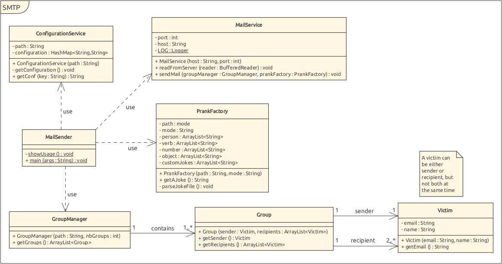
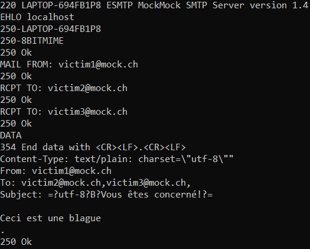

# README.md

## Description
Le but de ce projet est de programmer un robot configurable qui envoie des plaisanteries par mail. L'utilisateur va compiler une liste de victimes et une liste de paramètres pour sa campagne de spam. L'application va diviser la liste de victimes en plusieurs groupes d'au moins 3 personnes et choisir dans chaque groupe un émetteur qui va envoyer au reste de son groupe un mail contenant une joke personnalisée en utilisant le protocole SMTP. Ce programme est destiné à la formation uniquement dans le but de démontrer la simplicité de la forge de mail. Nous déclinons toute responsabilité pour un autre usage de ce programme. Avec de grands pouvoirs, viennent de grandes responsabilités.

## MockMock
MockMock est un outil qui permet de simuler un serveur SMTP, mais sans réellement acheminer les emails qui y transitent à leur destinataire. Notre but dans ce projet et de créer un programme qui permet d'envoyer des blagues par email à potentiellement beaucoup de victimes. Cependant, nous ne désirons pas importuner des gens qui n'ont rien demandé  en faisant nos tests. MockMock va donc nous être extrêmement utile afin de vérifier le bon fonctionnement du programme tout en ne dérangeant personne.

## Comment utiliser le projet
Afin de tester une campagne de pourriel dans environnement de test il faudra :
1. Paramétrer et lancer un mailtrap qui fait aussi serveur smtp
2. Compiler une liste de victime et de paramètres respectant le format requis
3. Compiler et lancer l'application

### Configurer un serveur SMTP MockMock
Dans cette section, nous expliquons comment implémenter le mailtrap MockMock à l'aide de docker. Nous allons utiliser le [fork](https://github.com/HEIGVD-Course-API/MockMock) MockMock de HEIGVD-Course-API. Voici les étapes à effectuer :
* Commencer par télécharger le code de MockMock
* Compiler le code ou exécuter le code déjà compilé dans release. (Généralement, il faudrait être sûr que le fichier compilé est bien celui que l'on souhaite pour des raisons de sécurité)
* Normalement, le serveur devrait écouter sur le port 25 et être disponible sur localhost:8282 avec la commande `java -jar MockMock.jar -p 25 -h 8282
  `
* Nous allons maintenant rendre ce service disponible dans un container docker. Premièrement il faut se placer dans le même dossier que l'exécutable du mailtrap.
* Rédiger le dockerfile de la manière suivante:
```
FROM openjdk:11
COPY . .
WORKDIR .
CMD ["java", "-jar", "MockMock.jar"]
  ```
* Compiler l'image docker à l'aide de `docker build -t mailtrap .`
* Instancier un container et liez les ports à l'aide de `docker run -p 8282:8282 -p 25:25 mailtrap`
### Fichiers
Notre programme a besoin de 3 fichiers pour assurer son bon fonctionnement :
- Configuration.txt
- Victims.txt
- jokes.txt

#### Configuration
Le fichier de configuration doit contenir:
```
smtp_server <adresse du serveur>
smtp_port <25 par défaut>
nb_groups <nombre de groupe de la campagne de spam
```
#### Victims
Le fichier de victimes doit être structuré:
```
<email de la victime 1> <nom de la victime 1>
etc...
```
#### Jokes
Il peut exister 2 fichiers de configuration pour le mode joke pour chaque mode :

**mode Factory :**
```
<personne> <action> <nombre> <object>
etc...
```
**mode Custom :**
```
<joke1>
etc...
```

#### Lancer l'application
Afin de lancer l'application il faut exécuter:
`java -jar app <victims> <configuration> <jokes> <mode>`

## Structure du projet


### pranker.ConfigurationService
Cette classe s'occupe de parser le fichier de configuration qui contient le serveur et le port que l'on veut utiliser ainsi que le nombre de groupes afin de pouvoir utiliser ces paramètres dans notre rogramme par la suite.
### pranker.Group
Cette classe gère les informations d'un groupe que l'on veut piéger. Elle contient donc une liste de victimes, dont l'une va envoyer le mail forgé tandis que les autres seront les destinataires de ce mail. 
### pranker.GroupManager
Cette classe s'occupe de la gestion des différents groupes de notre campagne de mails forgés. Elle va donc séparer une liste de victimes en plusieurs groupes, chacun de ces groupes se voyant attribué une joke différente par la suite.
### pranker.MailSender
MailSender est en quelque sorte la classe principale de notre programme. Elle s'occupe de lire les arguments passés en ligne de commande par l'utilisateur, puis en fonction de ceux-ci elle crée un GroupManager et une PrankFactory avant d'utiliser MailService pour envoyer les différents emails à leur groupe respectif.
### pranker.MailService
Cette classe va faire le gros du travail de cette campagne de mails forgés. Elle ouvre une connection avec le serveur SMTP, puis pour chaque groupe de GroupManager elle va envoyer un mail avec une joke différente tout en lisant les réponses du serveur afin de gérer les éventuelles erreurs avec le protocole SMTP
### pranker.PrankFactory
Cette classe s'occupe de générer les blagues que l'on va emvoyer par mail. Elle a deux modes de fonctionnement selon le paramètre `<mode>` que l'on passe en ligne de commande. Si on choisit le mode Custom, elle choisit aléatoirement une blague dans un fichier de configuration (par exemple jokes_custom.txt). Si on choisit le mode Factory, elle va créer de toutes pièces une blague en concaténant un nom, un verbe, un nombre et un objet en se basant sur un fichier contenant chacun de ces éléments sur chacune de ses lignes (par exemple jokes_factory.txt).
### pranker.Victim
Cette classe gère les informations concernant une victime, en l'occurence son email et son nom.

## Exemple de dialogue

